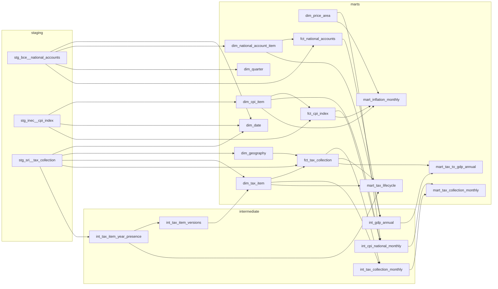

# dbt lineage

Generated by `lakehouse docs --mermaid docs/LINEAGE.md` from a fresh
`dbt parse`. Do not edit by hand.

```mermaid
flowchart LR
  subgraph staging
    stg_bce__national_accounts["stg_bce__national_accounts"]
    stg_inec__cpi_index["stg_inec__cpi_index"]
    stg_sri__tax_collection["stg_sri__tax_collection"]
  end
  subgraph intermediate
    int_cpi_national_monthly["int_cpi_national_monthly"]
    int_gdp_annual["int_gdp_annual"]
    int_tax_collection_monthly["int_tax_collection_monthly"]
    int_tax_item_versions["int_tax_item_versions"]
    int_tax_item_year_presence["int_tax_item_year_presence"]
  end
  subgraph marts
    dim_cpi_item["dim_cpi_item"]
    dim_date["dim_date"]
    dim_geography["dim_geography"]
    dim_national_account_item["dim_national_account_item"]
    dim_price_area["dim_price_area"]
    dim_quarter["dim_quarter"]
    dim_tax_item["dim_tax_item"]
    fct_cpi_index["fct_cpi_index"]
    fct_national_accounts["fct_national_accounts"]
    fct_tax_collection["fct_tax_collection"]
    mart_inflation_monthly["mart_inflation_monthly"]
    mart_tax_collection_monthly["mart_tax_collection_monthly"]
    mart_tax_lifecycle["mart_tax_lifecycle"]
    mart_tax_to_gdp_annual["mart_tax_to_gdp_annual"]
  end
  dim_cpi_item --> fct_cpi_index
  dim_cpi_item --> int_cpi_national_monthly
  dim_cpi_item --> mart_inflation_monthly
  dim_geography --> fct_tax_collection
  dim_national_account_item --> fct_national_accounts
  dim_national_account_item --> int_gdp_annual
  dim_price_area --> int_cpi_national_monthly
  dim_price_area --> mart_inflation_monthly
  dim_tax_item --> fct_tax_collection
  dim_tax_item --> int_tax_collection_monthly
  dim_tax_item --> mart_tax_lifecycle
  fct_cpi_index --> int_cpi_national_monthly
  fct_cpi_index --> mart_inflation_monthly
  fct_national_accounts --> int_gdp_annual
  fct_tax_collection --> int_tax_collection_monthly
  fct_tax_collection --> mart_tax_lifecycle
  fct_tax_collection --> mart_tax_to_gdp_annual
  int_cpi_national_monthly --> mart_tax_collection_monthly
  int_gdp_annual --> mart_tax_to_gdp_annual
  int_tax_collection_monthly --> mart_tax_collection_monthly
  int_tax_item_versions --> dim_tax_item
  int_tax_item_year_presence --> int_tax_item_versions
  int_tax_item_year_presence --> mart_tax_lifecycle
  stg_bce__national_accounts --> dim_date
  stg_bce__national_accounts --> dim_national_account_item
  stg_bce__national_accounts --> dim_quarter
  stg_bce__national_accounts --> fct_national_accounts
  stg_inec__cpi_index --> dim_cpi_item
  stg_inec__cpi_index --> dim_date
  stg_inec__cpi_index --> fct_cpi_index
  stg_sri__tax_collection --> dim_date
  stg_sri__tax_collection --> dim_geography
  stg_sri__tax_collection --> dim_tax_item
  stg_sri__tax_collection --> fct_tax_collection
  stg_sri__tax_collection --> int_tax_item_year_presence
```
